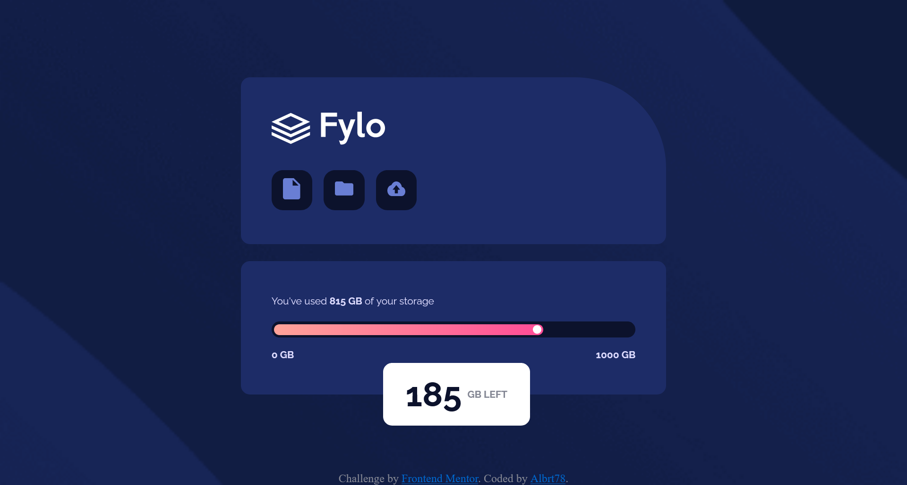

# Frontend Mentor - Fylo data storage component solution

This is a solution to the [Fylo data storage component challenge on Frontend Mentor](https://www.frontendmentor.io/challenges/fylo-data-storage-component-1dZPRbV5n). Frontend Mentor challenges help you improve your coding skills by building realistic projects.

## Table of contents

-   [Overview](#overview)
-   [The challenge](#the-challenge)
-   [Screenshot](#screenshot)
-   [Links](#links)
-   [Built with](#built-with)
-   [Useful resources](#useful-resources)
-   [Author](#author)

## Overview

This challenge is designed based on the provided template from Frontend Mentor which help us improve our coding skills by building realistic projects.

### The challenge

Users should be able to:

-   View the optimal layout for the site depending on their device's screen size

### Screenshot

### Links

-   Solution URL: [Fylo Data Storage Component Master](https://github.com/Albrt78/fylocomponentcard.github.io)
-   Live Site URL: [Fylo Data Storage Component Master](https://albrt78.github.io/fylocomponentcard.github.io/)

### Built with

-   Semantic HTML5 markup
-   CSS custom properties
-   Flexbox

### Useful resources

-   [Smashing Magazine](https://www.smashingmagazine.com/2021/12/create-custom-range-input-consistent-browsers/) - This helped me how to style the range in CSS.
-   [W3Schools](https://www.w3schools.com/howto/howto_js_rangeslider.asp) - This is an amazing article which also helped me understand how styling range input in CSS.

## Author

-   Frontend Mentor - [Albrt78](https://www.frontendmentor.io/profile/Albrt78)
